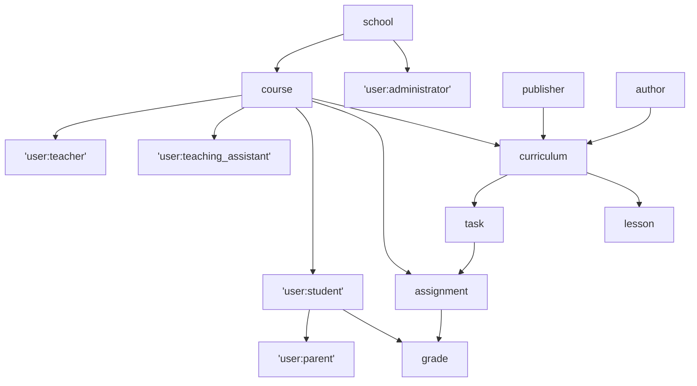

## Ports

| Service    | Internal Port | External Port | APISIX Path                         | Purpose                  | Username | Password | Store Name(s)                |
|------------|---------------|---------------|-------------------------------------|--------------------------|----------|----------|------------------------------|
| api        | 9001          | 9001          | http://localhost:9080/api/v1        | API Server               |          |          |                              |
| APISIX     | 9080          | 9080          |                                     | API Gateway              |          |          |                              |
| Grafana    | 4000          | 3000          | http://localhost:9080/admin/grafana | Monitoring Dashboards    | grafana  | grafana  |                              |
| Keycloak   | 4567          | 4567          | http://localhost:9080/auth          | Authentication Server    | keycloak | keycloak |                              |
| Ollama     | 11434         | 11434         |                                     | Ollama local LLM         |          |          |                              |
| OpenFGA    | 8080          | 8080          |                                     | OpenFGA HTTP API         |          |          |                              |
| OpenFGA    | 8081          | 8081          |                                     | OpenFGA gRPC API         |          |          |                              |
| OpenFGA    | 3000          | 3000          | http://localhost:9080/admin/openfga | OpenFGA Playground       |          |          |                              |
| Postgres   | 5432          | 5432          |                                     | Primary DB               | postgres | postgres | gradebook, keycloak, openfga |
| PGAdmin    | 5080          | 5080          | http://localhost:9080/admin/pgadmin | DB Administration        | postgres | postgres |                              |
| Prometheus | 9090          | 9090          |                                     | Metrics Aggregator       |          |          |                              |
| Redis      | 6379          | 6379          |                                     | Cache, Pub/Sub           |          | redis    | redis                        |
| site       | 9000          | 9000          | http://localhost:9080/site          | Hugo Static Landing Site |          |          |                              |
| webapp     | 9002          | 9002          | http://localhost:9080/app           | WASM Web App             |          |          |                              |

## Application Resources

